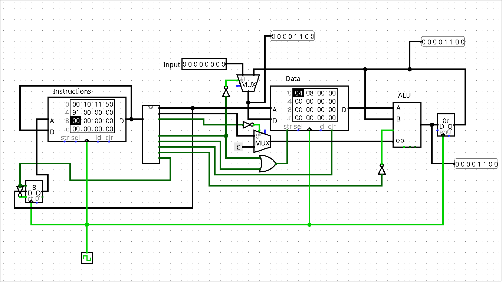

<h1>Shitotron 3000 Logisim CPU</h1>

A really crappy cpu built as a part of my uni studies.

<h2>Overview</h2>

The cpu was originally being built with Harvard architecture in mind, but somewhere along the way something went terribly wrong and now I have this.

<h3>Instructions</h3>

Instructions follow this pattern:

X.YYY.ZZZZ

where X defines wether an operation involves ALU or not

Y defines the operation itsself

and Z define an address of memory cell to operate with/on

<h3>Current list of instructions</h3>
<ol>
  <li>idle: "0000xxxx"</li>
  <li>input: "0001xxxx"</li>
  <li>jump: "0010xxxx"</li>
  <li>write to ALU register: "0101xxxx"</li>
  <li>clear RAM: "01110000"</li>
  <li>sum with a number in ALU register: "1001xxxx"</li>
  <li>subtract a number from one in ALU register: "1010xxxx"</li>
  <li>right bit shift: "1011xxxx"</li>
  <li>left bit shift: "1100xxxx"</li>
  <li>logical or: "1101xxxx"</li>
  <li>logical and: "1110xxxx"</li>
  <li>logical not: "1111xxxx"</li>
</ol>
<h3>Custom assembler</h3>

This project also includes a python script which serves as an assembler

To use it create a .ass file with your set of instructions (each pair action-value should be on a separate line!). Then run the python script and input your file's name (include extension).
  After compilation is done open up cpu.circ file in Logisim, right click the instructions RAM module -> Edit Contents -> Open your file and your good to go.

  <h3>A little warning</h3>
  
Currently the CPU has no way of hulting or going out of loops (except for overflowing)! (Maybe will be implemented in far future)

